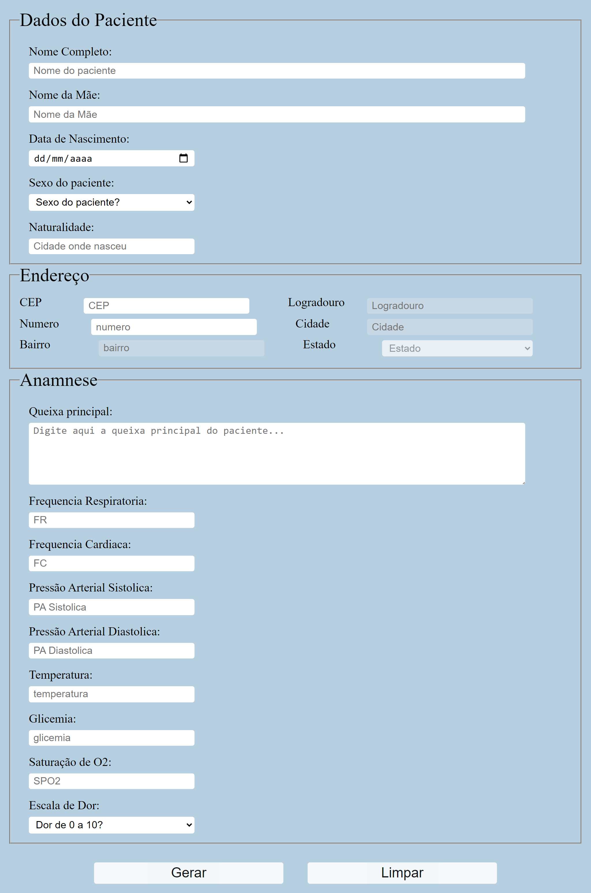
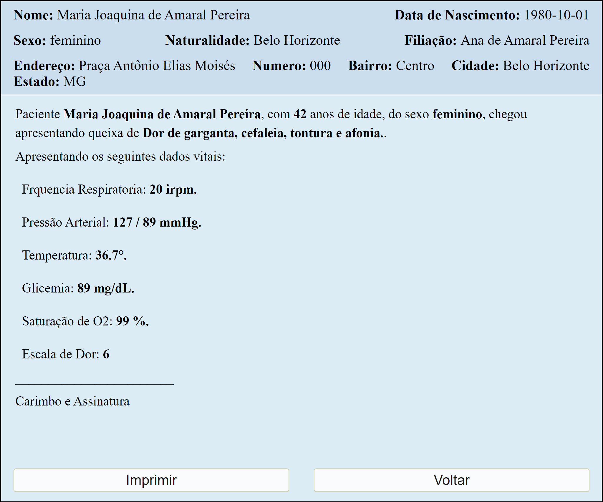

# **Gerador de Portuário por Triagem Hospitalar.** <h1>

Deseja conferir como ficou o resultado do projeto? Teste a funcionalidade através deste Link: [Clique Aqui]( https://jorgedeaquino.github.io/Gerador-de-protuario-por-triagem-hospitalar/).

## **Demonstração Desktop**
  
 

## **Demonstração Mobile** <h2>

  

## **Sobre o Projeto** <h2>
  
Este projeto surgiu por meio da segunda semana de desafios para criar um projeto do zero em apenas uma semana, através da mentoria do [Pedro Marins]( https://www.linkedin.com/in/pedromarins/) e [Henrique de Andrade]( https://www.linkedin.com/in/henrique-de-andrade/).
Como funcionalidades, possibilita inserir os dados pessoais dos pacientes e os seus parâmetros (dados vitais), organizar essas informações triadas por um profissional da saúde responsavel e gerar um prontuário, para atendimento ou encaminhamento para o setor responsável.

  
## **Tecnologias Utilizadas** <h2>

* JavaScript 
  
* HTML 
  
* CSS 

* Consumo de API ViaCEP

  
  
  
Contato: [Linkedin]( https://www.linkedin.com/in/jorge-alexandre-de-aquino/)
